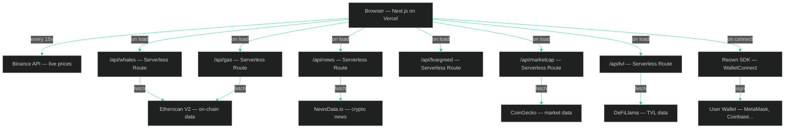

<div align="center">

# WHALETRACK

**Crypto Intelligence Dashboard**

[](https://nextjs.org)
[](https://typescriptlang.org)
[](https://whaletrack-ashen.vercel.app)
[](https://tailwindcss.com)
[](https://reown.com)

**[Live Demo →](https://whaletrack-ashen.vercel.app)**

</div>

My first Web3 project — a crypto dashboard I built to track what the biggest players in the market are doing in real-time. Started as a simple price tracker and grew into a full dashboard with live market data, on-chain whale monitoring, wallet connectivity and more.

## What it does

- Live prices for 15 tokens, updates every 15 seconds with a scrolling ticker on every page
- TradingView chart with multiple timeframes and fullscreen
- Market heatmap showing which tokens are up or down at a glance
- Fear & Greed Index with the last 7 days of history
- Global market cap, 24h volume and BTC/ETH dominance
- ETH gas tracker with slow, normal and fast prices
- DeFi TVL broken down by chain
- Trending coins updated every few minutes
- Click any token to see market cap, all-time high, circulating supply and more
- Search any token on Binance right from the navbar
- Whale tracker pulling real on-chain data from major Ethereum wallets — Exchanges, Market Makers, Whales and DeFi protocols with category filtering
- Portfolio tracker — add your holdings manually with a performance chart, or connect your wallet for real data with ENS name support
- Multi-wallet tracker — add any Ethereum address and track multiple wallets at once
- Price alerts with browser notifications when a token hits your target
- Token converter — convert any crypto to USD, EUR, GBP, JPY and more
- Social sentiment — Twitter followers, Reddit stats and community bullish/bearish vote per token
- Staking calculator — see daily, monthly and yearly rewards for ETH, SOL, ADA, DOT and ATOM
- NFT holdings — see your NFTs when wallet is connected
- Crypto news feed with filtering by Bitcoin, Ethereum and Solana
- Wallet connect supporting MetaMask, Coinbase and 500+ wallets
- CSV export for your portfolio

## Architecture


## Stack

| Layer | Technology |
|---|---|
| Framework | Next.js 14 (App Router) |
| Language | TypeScript |
| Styling | TailwindCSS |
| Animations | Framer Motion |
| Wallet | Reown / WalletConnect |
| Charts | TradingView Widget |
| Market Data | Binance API, CoinGecko API |
| On-chain | Etherscan V2 API |
| DeFi Data | DeFiLlama API |
| News | NewsData.io API |
| Deployment | Vercel |

## Run locally
```bash
git clone https://github.com/kurzmichael02-hue/whaletrack.git
cd whaletrack && npm install && npm run dev
```

Add `.env.local`:
```
ETHERSCAN_API_KEY=your_key_here
NEWSDATA_API_KEY=your_key_here
NEXT_PUBLIC_WALLETCONNECT_PROJECT_ID=your_key_here
```

Frontend → http://localhost:3000

## Project Structure
```
whaletrack/
├── app/
│   ├── api/
│   │   ├── whales/          ← On-chain whale tracking
│   │   ├── news/            ← Crypto news feed
│   │   ├── marketcap/       ← Global market stats
│   │   ├── feargreed/       ← Fear & Greed Index
│   │   ├── trending/        ← Trending coins
│   │   ├── gas/             ← ETH gas tracker
│   │   ├── tvl/             ← DeFi TVL by chain
│   │   ├── token/           ← Token detail data
│   │   ├── sentiment/       ← Social sentiment
│   │   ├── staking/         ← Staking APY data
│   │   ├── nfts/            ← NFT holdings
│   │   ├── ens/             ← ENS name resolution
│   │   └── wallet/          ← Connected wallet data
│   ├── components/
│   │   ├── Ticker.tsx           ← Live scrolling price ticker
│   │   ├── LiveStats.tsx        ← Portfolio value & PnL
│   │   ├── MarketStats.tsx      ← Market cap & dominance
│   │   ├── FearGreed.tsx        ← Fear & Greed Index
│   │   ├── GasAndTVL.tsx        ← Gas tracker + DeFi TVL
│   │   ├── Heatmap.tsx          ← Market heatmap
│   │   ├── Trending.tsx         ← Trending coins
│   │   ├── PriceChart.tsx       ← TradingView chart
│   │   ├── TokenTable.tsx       ← Live market overview
│   │   ├── TokenDetail.tsx      ← Token detail modal
│   │   ├── TokenSearch.tsx      ← Navbar search
│   │   ├── Sparkline.tsx        ← Mini price charts
│   │   ├── WalletDashboard.tsx  ← Real wallet data + ENS
│   │   ├── MultiWallet.tsx      ← Multi-wallet tracker
│   │   ├── PortfolioChart.tsx   ← Historical performance
│   │   ├── PriceAlerts.tsx      ← Browser notifications
│   │   ├── TokenConverter.tsx   ← Crypto to fiat converter
│   │   ├── SocialSentiment.tsx  ← Twitter/Reddit stats
│   │   ├── StakingTracker.tsx   ← Staking rewards calc
│   │   ├── NFTHoldings.tsx      ← NFT display
│   │   ├── ExportCSV.tsx        ← CSV export
│   │   ├── LandingGate.tsx      ← Intro page
│   │   ├── Navbar.tsx
│   │   └── Sidebar.tsx
│   ├── alerts/
│   ├── converter/           ← Tools page
│   ├── portfolio/
│   ├── wallets/             ← Multi-wallet tracker
│   ├── trades/
│   ├── whales/
│   ├── news/
│   ├── settings/
│   └── page.tsx             ← Dashboard
└── .env.local
```

## Status

Work in progress. More features coming.
