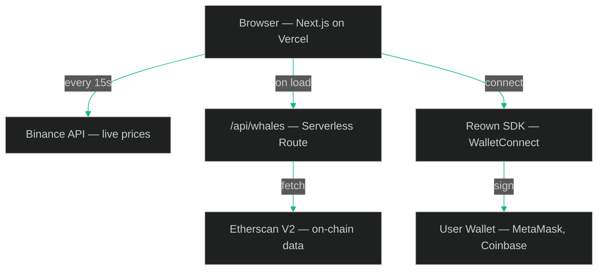

# WhaleTrack 🐋

My first Web3 project — a crypto dashboard I built to track what the biggest players in the market are doing in real-time. Shows live prices for 15 tokens with auto-refresh, monitors on-chain transactions from major Ethereum whale wallets like Binance, Vitalik and market makers like Cumberland and Jump Trading, and includes a portfolio tracker with real PnL based on live market data. Wallet connectivity via WalletConnect built in.

## Architecture


## Stack

- **Frontend:** Next.js, TypeScript, TailwindCSS
- **Data:** Binance API, Etherscan V2 API
- **Wallet:** Reown / WalletConnect
- **Deployment:** Vercel

## Features

- Live prices for 15 tokens with auto-refresh every 15s
- Whale wallet monitoring — Binance, Vitalik, Cumberland, Jump Trading and more
- Portfolio tracker with real PnL based on current market prices
- Transaction history
- Connect your own wallet

## Run locally
```bash
git clone https://github.com/kurzmichael02-hue/whaletrack.git
cd whaletrack && npm install && npm run dev
```

Add `.env.local`:
```
ETHERSCAN_API_KEY=your_key_here
```

Frontend → http://localhost:3000

## Status

Work in progress.
